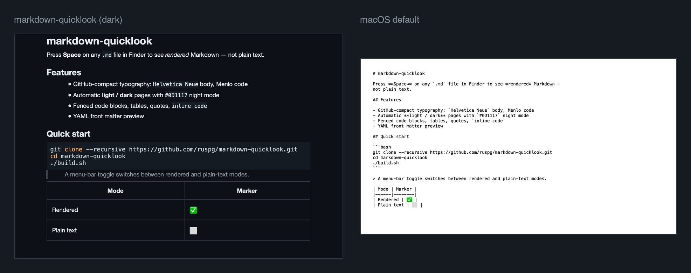
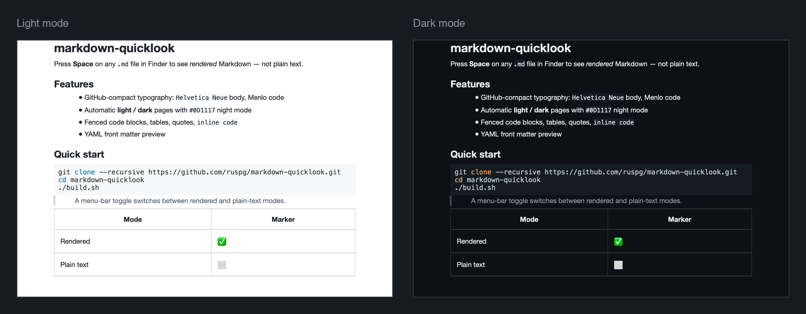

# markdown-quicklook

**Press Space on a `.md` file in Finder and read it, instead of squinting at its source.**

macOS has shipped Quick Look for fifteen years and still previews Markdown as plain text. This is a one-command fix: rendered Markdown, a GitHub-compact type system, automatic light and dark pages, and a menu bar switch for when you actually do want the source.





> Both images are produced by this project's real rendering engine through a local harness — same code path as the Quick Look extension, including the syntax colouring.

---

## Install

```bash
git clone --recursive https://github.com/ruspg/markdown-quicklook.git
cd markdown-quicklook
./build.sh
```

That's it. No sudo, no developer account. The script resets the submodule to pristine, applies the patch layer, **verifies all 68 patches by outcome**, builds and ad-hoc signs both apps, installs them to `~/Applications/`, registers the extensions and restarts Quick Look.

If upstream has drifted so a patch no longer lands, the build stops and tells you which assertion failed — it will not ship a silently wrong binary.

**Requirements** — macOS 13 or later, Apple Silicon or Intel; Xcode command line tools (developed on Xcode 26); network access on the first build, for Swift package resolution.

---

## The type system

Quick Look is a *reading* surface, so the theme is built like one. Every number below is measured off the real renderer, not estimated.

| | |
|---|---|
| **Body** | Helvetica Neue 14pt with true bold — no faux-bold blocks |
| **Code** | Menlo, inline at 0.9× so it matches the optical size of the prose it sits in |
| **Measure** | capped at 45em ≈ 95 characters, centred — the panel stays wide, the column doesn't |
| **Leading** | 20.90pt line pitch, line-height 1.49 — GitHub markdown parity |
| **Paragraphs** | 0.75em apart, half a line pitch, so a break reads as a break |
| **Pages** | `#FFFFFF` / `#0D1117`, ink `#1F2328` / `#E6EDF3` |

The heading ladder is six steps that are actually six steps:

| H1 | H2 | H3 | H4 | H5 | H6 |
|---|---|---|---|---|---|
| 1.75× | 1.4× | 1.2× | 1.0× | 0.9× | 0.85× muted |

H1–H3 also carry more space above them than below, so sections group visually rather than relying on size alone. H5 and H6 are floored at 11pt and 10.5pt, so the 10pt font setting stays legible instead of shrinking headings to 8.5pt.

Code blocks sit on a tinted panel, blockquotes get GitHub's left rule, and tables use mode-aware borders (`#D0D7DE` / `#30363D`).

Everything here is a wrapper default. The PreviewMarkdown app's own Settings window still drives font, size, colours, margin and line spacing on top of it.

---

## QLToggle

A menu bar icon appears alongside the preview extension.

- **Filled icon** — Markdown rendering is on. **Outline icon** — plain text.
- One click toggles both extensions (Previewer and Thumbnailer) together
- Live status lines for each extension, read from `pluginkit`
- **Launch at Login** via `SMAppService`, with errors surfaced in the menu rather than swallowed
- **Restart Quick Look** for when previews go stale
- **PreviewMarkdown Settings…** opens the host app

Universal binary (arm64 + x86_64).

> After toggling, press Space twice — Quick Look caches the previous renderer.

---

## Everyday commands

```bash
./build.sh --check      # patch + verify only; restores the tree. Safe pre-flight.
./test.sh               # test the installed product
./test.sh --quick       # bundle checks only
./reset-settings.sh     # reset preview settings to the shipped defaults
```

To pick up a new upstream release or recover after an Xcode update:

```bash
git submodule update --remote
./build.sh --check      # confirm every patch still applies
./build.sh
```

---

## How it works

[PreviewMarkdown](https://github.com/smittytone/PreviewMarkdown) is a source-available macOS app by [@smittytone](https://github.com/smittytone) that provides the Quick Look extensions. It's sold on the [App Store](https://apps.apple.com/app/previewmarkdown/id1492280469), and the repository intentionally omits a few files — the feedback endpoint, the Team ID, the asset catalogue.

This project adds:

- **Stubs** for the omitted files, so the project builds standalone
- **A semantic patch layer** — every source change is a `sed`/`perl` rewrite applied to a *clean* checkout, never a committed edit to the submodule. Paths, bundle identifiers, code signing, entitlements, fonts, colours, spacing and layout all go through it.
- **A verification gate** — 68 outcome assertions run after patching. They check the result, not the diff, so an upstream refactor that moves code around is fine and one that changes meaning is caught.
- **The "GitHub Compact" theme**, applied entirely through that layer
- **QLToggle**, an original menu bar utility

There is no CSS and no WebView anywhere in the render path: PreviewMarkdown builds an `NSAttributedString` and lays it out with TextKit. The theme is Swift attributes, text tables and paragraph styles.

---

## Known limitations

- **Thumbnails** use a separate fixed-size pipeline and look plainer than previews. The `qlmanage` thumbnail channel is also unreliable to drive from scripts, which is why `test.sh` treats render checks as best-effort and bundle checks as hard.
- **Ad-hoc signing** means these builds are local-only. They are not notarized, so a copy downloaded from the internet needs its quarantine flag cleared before macOS will load the extensions.

---

## Uninstall

```bash
# Disable Launch at Login in the QLToggle menu first (or System Settings → Login Items)
rm -rf ~/Applications/PreviewMarkdown.app ~/Applications/QLToggle.app
rm -rf ~/Library/Group\ Containers/com.local.suite.previewmarkdown
rm -f  ~/Library/Preferences/com.local.suite.previewmarkdown.plist
qlmanage -r
```

---

## License

QLToggle, the build and test scripts, and the patch layer: [MIT](LICENSE).

PreviewMarkdown itself: see the [upstream license](https://github.com/smittytone/PreviewMarkdown/blob/main/LICENSE.md). If you want the notarized, supported version with the developer's own defaults, [buy it on the App Store](https://apps.apple.com/app/previewmarkdown/id1492280469) — this wrapper exists for local builds and a different set of typographic opinions.
